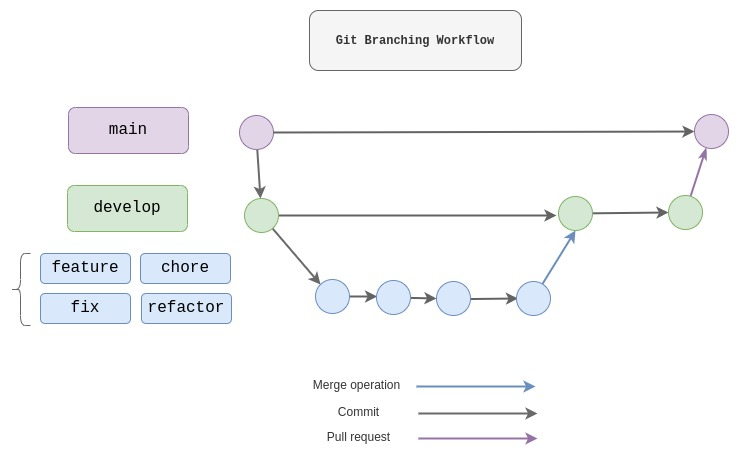

## Branching

Simple 3 layers branching pattern with the following:
- `main`: Production branch
- `develop`: Staging & testing branch
- `feature`, `fix`, `refactor`, `chore`, `test`, `docs`: Local development branches

The principles are the following:

- Always develop in third-layer branches (blue in the graph).
- Merge the finished branch on `develop`, then push `develop` to GitHub.
- Pull request develop into main when creating a release.
- Tag the commit releases in the main branch.
